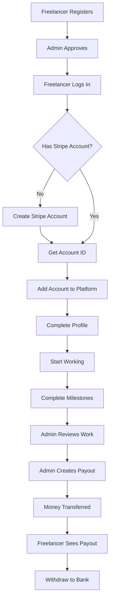
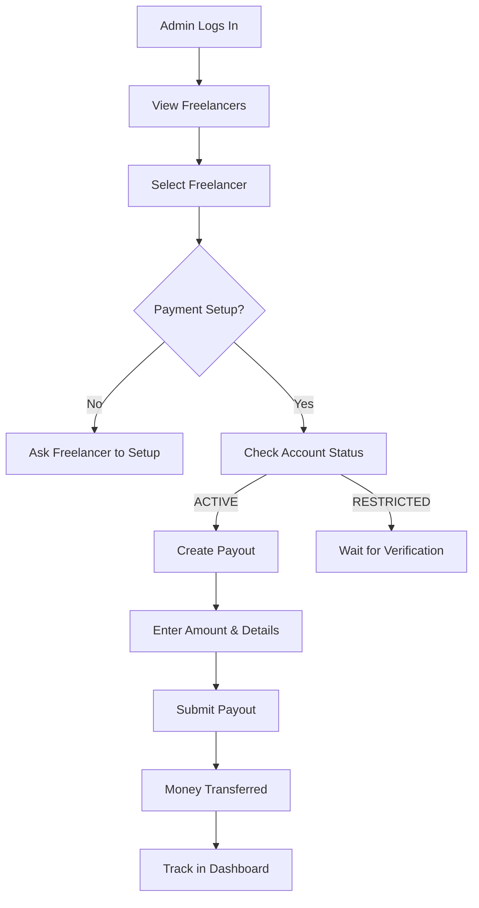

# Frontend Integration Guide - Freelancer Payout System

## 🎨 Complete Frontend Integration Documentation

**For:** Frontend Developers  
**Backend:** Freelancer Payout System API  
**Roles:** Admin & Freelancer

---

## Table of Contents

1. [Overview](#overview)
2. [User Flows](#user-flows)
3. [Admin Frontend Integration](#admin-frontend-integration)
4. [Freelancer Frontend Integration](#freelancer-frontend-integration)
5. [UI Components Needed](#ui-components-needed)
6. [Code Examples](#code-examples)
7. [State Management](#state-management)

---

## Overview

### System Architecture

```
┌─────────────────┐         API Calls        ┌─────────────────┐
│                 │ ───────────────────────→ │                 │
│  Frontend App   │                          │  Backend API    │
│  (React/Next)   │ ←─────────────────────── │  (Your Server)  │
│                 │      JSON Responses      │                 │
└─────────────────┘                          └─────────────────┘
        │                                              │
        │                                              │
    ┌───┴───┐                                    ┌────┴────┐
    │       │                                    │         │
  Admin  Freelancer                           Stripe    Database
  Pages    Pages                              Connect
```

### Roles & Permissions

| Role           | Can Do                                                                                                                                 |
| -------------- | -------------------------------------------------------------------------------------------------------------------------------------- |
| **Admin**      | • View all freelancers' payment details<br>• Create payouts<br>• View all payout history<br>• Cancel payouts<br>• Update payout status |
| **Freelancer** | • Add their Stripe account<br>• View own payment details<br>• View own payout history<br>• Remove payment details                      |

---

## User Flows

### 🎯 Complete Freelancer Flow



### 💰 Complete Admin Payout Flow



---

## Admin Frontend Integration

### 1. Admin Dashboard - View All Freelancers with Payment Status

**API Endpoint:** `GET /api/v1/admin/freelancers`

**What to Display:**

```typescript
interface FreelancerWithPayment {
  id: string;
  name: string;
  email: string;
  status: "ACCEPTED" | "PENDING" | "REJECTED";
  stripeAccountStatus: "ACTIVE" | "RESTRICTED" | "PENDING" | "NOT_CONNECTED";
  paymentDetailsVerified: boolean;
  totalEarnings?: number; // Calculate from payouts
}
```

**UI Components:**

- Freelancer list table
- Payment status badge (Green for ACTIVE, Yellow for PENDING, Red for NOT_CONNECTED)
- "Create Payout" button (enabled only if ACTIVE)
- "View Details" link

**Frontend Code Example:**

```typescript
// AdminFreelancerList.tsx
import { useState, useEffect } from 'react';

interface Freelancer {
  id: string;
  details: {
    fullName: string;
    email: string;
  };
  stripeAccountStatus: string;
  paymentDetailsVerified: boolean;
}

export const AdminFreelancerList = () => {
  const [freelancers, setFreelancers] = useState<Freelancer[]>([]);
  const [loading, setLoading] = useState(true);

  useEffect(() => {
    fetchFreelancers();
  }, []);

  const fetchFreelancers = async () => {
    try {
      const token = localStorage.getItem('adminToken');
      const response = await fetch('/api/v1/admin/freelancers', {
        headers: {
          'Authorization': `Bearer ${token}`,
        },
      });
      const data = await response.json();
      setFreelancers(data.data);
    } catch (error) {
      console.error('Error fetching freelancers:', error);
    } finally {
      setLoading(false);
    }
  };

  const getStatusBadge = (status: string) => {
    const colors = {
      ACTIVE: 'bg-green-100 text-green-800',
      PENDING: 'bg-yellow-100 text-yellow-800',
      RESTRICTED: 'bg-orange-100 text-orange-800',
      NOT_CONNECTED: 'bg-red-100 text-red-800',
    };
    return colors[status] || 'bg-gray-100 text-gray-800';
  };

  return (
    <div className="container mx-auto p-6">
      <h1 className="text-2xl font-bold mb-6">Freelancers - Payment Management</h1>

      <table className="min-w-full bg-white shadow-md rounded-lg">
        <thead className="bg-gray-50">
          <tr>
            <th className="px-6 py-3 text-left">Name</th>
            <th className="px-6 py-3 text-left">Email</th>
            <th className="px-6 py-3 text-left">Payment Status</th>
            <th className="px-6 py-3 text-left">Actions</th>
          </tr>
        </thead>
        <tbody>
          {freelancers.map((freelancer) => (
            <tr key={freelancer.id} className="border-t">
              <td className="px-6 py-4">{freelancer.details.fullName}</td>
              <td className="px-6 py-4">{freelancer.details.email}</td>
              <td className="px-6 py-4">
                <span className={`px-3 py-1 rounded-full text-sm ${getStatusBadge(freelancer.stripeAccountStatus)}`}>
                  {freelancer.stripeAccountStatus}
                </span>
              </td>
              <td className="px-6 py-4">
                <button
                  onClick={() => window.location.href = `/admin/freelancers/${freelancer.id}/payout`}
                  disabled={freelancer.stripeAccountStatus !== 'ACTIVE'}
                  className="bg-blue-500 text-white px-4 py-2 rounded disabled:bg-gray-300"
                >
                  Create Payout
                </button>
              </td>
            </tr>
          ))}
        </tbody>
      </table>
    </div>
  );
};
```

---

### 2. Check Freelancer Payment Details

**API Endpoint:** `GET /api/v1/admin/freelancers/{id}/payment-details`

**When to Call:** Before showing the "Create Payout" form

**Response Example:**

```json
{
  "success": true,
  "data": {
    "freelancer": {
      "id": "freelancer-uuid",
      "stripeAccountId": "acct_xxxxx",
      "stripeAccountStatus": "ACTIVE",
      "paymentDetailsVerified": true
    },
    "stripeAccountDetails": {
      "chargesEnabled": true,
      "payoutsEnabled": true,
      "requirementsCurrentlyDue": []
    }
  }
}
```

**Frontend Code:**

```typescript
// CheckPaymentStatus.tsx
const checkPaymentStatus = async (freelancerId: string) => {
  const token = localStorage.getItem("adminToken");
  const response = await fetch(
    `/api/v1/admin/freelancers/${freelancerId}/payment-details`,
    {
      headers: { Authorization: `Bearer ${token}` },
    },
  );
  const data = await response.json();

  if (data.data.freelancer.stripeAccountStatus !== "ACTIVE") {
    alert("Freelancer needs to complete payment setup first!");
    return false;
  }

  return true;
};
```

---

### 3. Create Payout Form

**API Endpoint:** `POST /api/v1/admin/freelancers/{id}/payout`

**Form Fields:**

- Amount (number, required)
- Currency (dropdown, default: USD)
- Payout Type (dropdown: MILESTONE, PROJECT, BONUS, MANUAL)
- Description (text, required)
- Notes (textarea, optional)
- Project ID (optional, autocomplete)
- Milestone ID (optional, autocomplete)

**Frontend Code:**

```typescript
// CreatePayoutForm.tsx
import { useState } from 'react';

interface PayoutFormData {
  amount: number;
  currency: string;
  payoutType: 'MILESTONE' | 'PROJECT' | 'BONUS' | 'MANUAL';
  description: string;
  notes: string;
  projectId?: string;
  milestoneId?: string;
}

export const CreatePayoutForm = ({ freelancerId }: { freelancerId: string }) => {
  const [formData, setFormData] = useState<PayoutFormData>({
    amount: 0,
    currency: 'usd',
    payoutType: 'MILESTONE',
    description: '',
    notes: '',
  });
  const [loading, setLoading] = useState(false);
  const [error, setError] = useState('');
  const [success, setSuccess] = useState(false);

  const handleSubmit = async (e: React.FormEvent) => {
    e.preventDefault();
    setLoading(true);
    setError('');

    try {
      const token = localStorage.getItem('adminToken');
      const response = await fetch(
        `/api/v1/admin/freelancers/${freelancerId}/payout`,
        {
          method: 'POST',
          headers: {
            'Authorization': `Bearer ${token}`,
            'Content-Type': 'application/json',
          },
          body: JSON.stringify(formData),
        }
      );

      const data = await response.json();

      if (data.success) {
        setSuccess(true);
        alert(`Payout created successfully! Transfer ID: ${data.data.stripeTransferId}`);
        // Redirect to payout history
        window.location.href = `/admin/payouts`;
      } else {
        setError(data.message || 'Failed to create payout');
      }
    } catch (err) {
      setError('Network error. Please try again.');
    } finally {
      setLoading(false);
    }
  };

  return (
    <form onSubmit={handleSubmit} className="max-w-2xl mx-auto p-6 bg-white shadow-md rounded-lg">
      <h2 className="text-2xl font-bold mb-6">Create Payout</h2>

      {error && (
        <div className="bg-red-100 border border-red-400 text-red-700 px-4 py-3 rounded mb-4">
          {error}
        </div>
      )}

      {success && (
        <div className="bg-green-100 border border-green-400 text-green-700 px-4 py-3 rounded mb-4">
          Payout created successfully!
        </div>
      )}

      <div className="mb-4">
        <label className="block text-gray-700 font-bold mb-2">
          Amount (USD) *
        </label>
        <input
          type="number"
          step="0.01"
          min="0"
          required
          value={formData.amount}
          onChange={(e) => setFormData({ ...formData, amount: parseFloat(e.target.value) })}
          className="w-full px-3 py-2 border rounded-lg focus:outline-none focus:ring-2 focus:ring-blue-500"
          placeholder="500.00"
        />
      </div>

      <div className="mb-4">
        <label className="block text-gray-700 font-bold mb-2">
          Payout Type *
        </label>
        <select
          required
          value={formData.payoutType}
          onChange={(e) => setFormData({ ...formData, payoutType: e.target.value as any })}
          className="w-full px-3 py-2 border rounded-lg focus:outline-none focus:ring-2 focus:ring-blue-500"
        >
          <option value="MILESTONE">Milestone Completion</option>
          <option value="PROJECT">Project Completion</option>
          <option value="BONUS">Performance Bonus</option>
          <option value="MANUAL">Manual Payment</option>
        </select>
      </div>

      <div className="mb-4">
        <label className="block text-gray-700 font-bold mb-2">
          Description *
        </label>
        <input
          type="text"
          required
          value={formData.description}
          onChange={(e) => setFormData({ ...formData, description: e.target.value })}
          className="w-full px-3 py-2 border rounded-lg focus:outline-none focus:ring-2 focus:ring-blue-500"
          placeholder="Milestone 1 - Dashboard Development"
        />
      </div>

      <div className="mb-4">
        <label className="block text-gray-700 font-bold mb-2">
          Notes (Optional)
        </label>
        <textarea
          rows={3}
          value={formData.notes}
          onChange={(e) => setFormData({ ...formData, notes: e.target.value })}
          className="w-full px-3 py-2 border rounded-lg focus:outline-none focus:ring-2 focus:ring-blue-500"
          placeholder="Additional notes about this payout..."
        />
      </div>

      <button
        type="submit"
        disabled={loading}
        className="w-full bg-blue-500 text-white py-3 rounded-lg font-bold hover:bg-blue-600 disabled:bg-gray-300"
      >
        {loading ? 'Creating Payout...' : 'Create Payout'}
      </button>
    </form>
  );
};
```

---

### 4. View All Payouts Dashboard

**API Endpoint:** `GET /api/v1/admin/payouts?page=1&limit=20&status=PROCESSING`

**Query Parameters:**

- `page` (number): Page number for pagination
- `limit` (number): Results per page
- `status` (string): Filter by status (PENDING, PROCESSING, PAID, FAILED, CANCELLED)
- `freelancerId` (string): Filter by specific freelancer
- `payoutType` (string): Filter by type

**Frontend Code:**

```typescript
// AdminPayoutsDashboard.tsx
import { useState, useEffect } from 'react';

interface Payout {
  id: string;
  amount: string;
  currency: string;
  status: string;
  payoutType: string;
  description: string;
  stripeTransferId: string;
  createdAt: string;
  freelancer: {
    details: {
      fullName: string;
    };
  };
}

export const AdminPayoutsDashboard = () => {
  const [payouts, setPayouts] = useState<Payout[]>([]);
  const [filters, setFilters] = useState({
    page: 1,
    limit: 20,
    status: '',
  });

  useEffect(() => {
    fetchPayouts();
  }, [filters]);

  const fetchPayouts = async () => {
    const token = localStorage.getItem('adminToken');
    const queryParams = new URLSearchParams(filters as any).toString();

    const response = await fetch(
      `/api/v1/admin/payouts?${queryParams}`,
      {
        headers: { 'Authorization': `Bearer ${token}` },
      }
    );

    const data = await response.json();
    setPayouts(data.data.payouts);
  };

  const getStatusColor = (status: string) => {
    const colors = {
      PENDING: 'bg-yellow-100 text-yellow-800',
      PROCESSING: 'bg-blue-100 text-blue-800',
      PAID: 'bg-green-100 text-green-800',
      FAILED: 'bg-red-100 text-red-800',
      CANCELLED: 'bg-gray-100 text-gray-800',
    };
    return colors[status] || 'bg-gray-100 text-gray-800';
  };

  return (
    <div className="container mx-auto p-6">
      <div className="flex justify-between items-center mb-6">
        <h1 className="text-2xl font-bold">All Payouts</h1>

        <select
          value={filters.status}
          onChange={(e) => setFilters({ ...filters, status: e.target.value, page: 1 })}
          className="px-4 py-2 border rounded-lg"
        >
          <option value="">All Status</option>
          <option value="PENDING">Pending</option>
          <option value="PROCESSING">Processing</option>
          <option value="PAID">Paid</option>
          <option value="FAILED">Failed</option>
          <option value="CANCELLED">Cancelled</option>
        </select>
      </div>

      <div className="bg-white shadow-md rounded-lg overflow-hidden">
        <table className="min-w-full">
          <thead className="bg-gray-50">
            <tr>
              <th className="px-6 py-3 text-left">Freelancer</th>
              <th className="px-6 py-3 text-left">Amount</th>
              <th className="px-6 py-3 text-left">Type</th>
              <th className="px-6 py-3 text-left">Status</th>
              <th className="px-6 py-3 text-left">Date</th>
              <th className="px-6 py-3 text-left">Actions</th>
            </tr>
          </thead>
          <tbody>
            {payouts.map((payout) => (
              <tr key={payout.id} className="border-t hover:bg-gray-50">
                <td className="px-6 py-4">
                  {payout.freelancer.details.fullName}
                </td>
                <td className="px-6 py-4 font-semibold">
                  ${parseFloat(payout.amount).toFixed(2)}
                </td>
                <td className="px-6 py-4">{payout.payoutType}</td>
                <td className="px-6 py-4">
                  <span className={`px-3 py-1 rounded-full text-sm ${getStatusColor(payout.status)}`}>
                    {payout.status}
                  </span>
                </td>
                <td className="px-6 py-4">
                  {new Date(payout.createdAt).toLocaleDateString()}
                </td>
                <td className="px-6 py-4">
                  <button
                    onClick={() => window.location.href = `/admin/payouts/${payout.id}`}
                    className="text-blue-600 hover:text-blue-800"
                  >
                    View Details
                  </button>
                </td>
              </tr>
            ))}
          </tbody>
        </table>
      </div>
    </div>
  );
};
```

---

### 5. View Specific Freelancer's Payout History

**API Endpoint:** `GET /api/v1/admin/freelancers/{id}/payouts`

**UI: Freelancer Detail Page with Payout History Section**

```typescript
// FreelancerPayoutHistory.tsx
const FreelancerPayoutHistory = ({ freelancerId }: { freelancerId: string }) => {
  const [payouts, setPayouts] = useState([]);

  useEffect(() => {
    fetchPayoutHistory();
  }, [freelancerId]);

  const fetchPayoutHistory = async () => {
    const token = localStorage.getItem('adminToken');
    const response = await fetch(
      `/api/v1/admin/freelancers/${freelancerId}/payouts`,
      {
        headers: { 'Authorization': `Bearer ${token}` },
      }
    );
    const data = await response.json();
    setPayouts(data.data);
  };

  const totalEarnings = payouts
    .filter(p => p.status === 'PAID')
    .reduce((sum, p) => sum + parseFloat(p.amount), 0);

  return (
    <div className="mt-8">
      <div className="flex justify-between items-center mb-4">
        <h3 className="text-xl font-bold">Payout History</h3>
        <div className="text-right">
          <p className="text-sm text-gray-600">Total Earnings</p>
          <p className="text-2xl font-bold text-green-600">
            ${totalEarnings.toFixed(2)}
          </p>
        </div>
      </div>

      {/* Payout list here */}
    </div>
  );
};
```

---

## Freelancer Frontend Integration

### 1. Payment Setup Page

**API Endpoint:** `POST /api/v1/freelancer/payment-details`

**What Freelancer Needs to Do:**

1. Create their own Stripe account at stripe.com
2. Complete Stripe's onboarding
3. Get their Stripe Account ID
4. Add it to your platform

**Frontend Code:**

```typescript
// FreelancerPaymentSetup.tsx
import { useState } from 'react';

export const FreelancerPaymentSetup = () => {
  const [stripeAccountId, setStripeAccountId] = useState('');
  const [loading, setLoading] = useState(false);
  const [error, setError] = useState('');
  const [success, setSuccess] = useState(false);

  const handleSubmit = async (e: React.FormEvent) => {
    e.preventDefault();
    setLoading(true);
    setError('');

    try {
      const token = localStorage.getItem('freelancerToken');
      const response = await fetch('/api/v1/freelancer/payment-details', {
        method: 'POST',
        headers: {
          'Authorization': `Bearer ${token}`,
          'Content-Type': 'application/json',
        },
        body: JSON.stringify({ stripeAccountId }),
      });

      const data = await response.json();

      if (data.success) {
        setSuccess(true);
        alert('Payment details added successfully! You can now receive payouts.');
      } else {
        setError(data.message || 'Failed to add payment details');
      }
    } catch (err) {
      setError('Network error. Please try again.');
    } finally {
      setLoading(false);
    }
  };

  return (
    <div className="max-w-2xl mx-auto p-6">
      <div className="bg-white shadow-md rounded-lg p-8">
        <h2 className="text-2xl font-bold mb-4">Set Up Payment Details</h2>

        <div className="bg-blue-50 border border-blue-200 rounded-lg p-4 mb-6">
          <h3 className="font-bold text-blue-900 mb-2">📝 Before You Start:</h3>
          <ol className="list-decimal list-inside space-y-2 text-blue-800">
            <li>Create a Stripe account at <a href="https://stripe.com" target="_blank" className="underline">stripe.com</a></li>
            <li>Complete Stripe's onboarding process</li>
            <li>Add your bank account information</li>
            <li>Find your Account ID in Stripe Dashboard → Settings → Account Details</li>
            <li>Copy and paste your Account ID below</li>
          </ol>
        </div>

        {error && (
          <div className="bg-red-100 border border-red-400 text-red-700 px-4 py-3 rounded mb-4">
            {error}
          </div>
        )}

        {success && (
          <div className="bg-green-100 border border-green-400 text-green-700 px-4 py-3 rounded mb-4">
            ✅ Payment details added successfully! You're all set to receive payouts.
          </div>
        )}

        <form onSubmit={handleSubmit}>
          <div className="mb-6">
            <label className="block text-gray-700 font-bold mb-2">
              Stripe Account ID *
            </label>
            <input
              type="text"
              required
              value={stripeAccountId}
              onChange={(e) => setStripeAccountId(e.target.value)}
              placeholder="acct_1A2B3C4D5E6F7G8H"
              className="w-full px-4 py-3 border rounded-lg focus:outline-none focus:ring-2 focus:ring-blue-500"
            />
            <p className="text-sm text-gray-600 mt-2">
              Format: acct_xxxxxxxxxxxxx (starts with "acct_")
            </p>
          </div>

          <button
            type="submit"
            disabled={loading}
            className="w-full bg-blue-500 text-white py-3 rounded-lg font-bold hover:bg-blue-600 disabled:bg-gray-300 transition"
          >
            {loading ? 'Verifying...' : 'Add Payment Details'}
          </button>
        </form>
      </div>
    </div>
  );
};
```

---

### 2. View Payment Details

**API Endpoint:** `GET /api/v1/freelancer/payment-details`

**Frontend Code:**

```typescript
// FreelancerPaymentDetails.tsx
import { useState, useEffect } from 'react';

interface PaymentDetails {
  stripeAccountId: string;
  stripeAccountStatus: string;
  paymentDetailsVerified: boolean;
}

export const FreelancerPaymentDetails = () => {
  const [details, setDetails] = useState<PaymentDetails | null>(null);
  const [loading, setLoading] = useState(true);

  useEffect(() => {
    fetchPaymentDetails();
  }, []);

  const fetchPaymentDetails = async () => {
    try {
      const token = localStorage.getItem('freelancerToken');
      const response = await fetch('/api/v1/freelancer/payment-details', {
        headers: { 'Authorization': `Bearer ${token}` },
      });
      const data = await response.json();

      if (data.success) {
        setDetails(data.data.freelancer);
      }
    } catch (error) {
      console.error('Error fetching payment details:', error);
    } finally {
      setLoading(false);
    }
  };

  const getStatusIcon = (status: string) => {
    if (status === 'ACTIVE') return '✅';
    if (status === 'PENDING') return '⏳';
    if (status === 'RESTRICTED') return '⚠️';
    return '❌';
  };

  const getStatusText = (status: string) => {
    if (status === 'ACTIVE') return 'Active - Ready to receive payments';
    if (status === 'PENDING') return 'Pending - Verification in progress';
    if (status === 'RESTRICTED') return 'Restricted - Complete verification in Stripe';
    return 'Not Connected - Add your Stripe account';
  };

  if (loading) return <div>Loading...</div>;

  if (!details) {
    return (
      <div className="text-center py-12">
        <p className="text-gray-600 mb-4">No payment details found</p>
        <button
          onClick={() => window.location.href = '/freelancer/payment-setup'}
          className="bg-blue-500 text-white px-6 py-3 rounded-lg"
        >
          Set Up Payment Details
        </button>
      </div>
    );
  }

  return (
    <div className="max-w-2xl mx-auto p-6">
      <div className="bg-white shadow-md rounded-lg p-8">
        <h2 className="text-2xl font-bold mb-6">Payment Details</h2>

        <div className={`border-l-4 ${details.stripeAccountStatus === 'ACTIVE' ? 'border-green-500 bg-green-50' : 'border-yellow-500 bg-yellow-50'} p-4 mb-6`}>
          <div className="flex items-center mb-2">
            <span className="text-2xl mr-2">
              {getStatusIcon(details.stripeAccountStatus)}
            </span>
            <span className="font-bold text-lg">
              {getStatusText(details.stripeAccountStatus)}
            </span>
          </div>
        </div>

        <div className="space-y-4">
          <div>
            <label className="block text-gray-600 mb-1">Stripe Account ID</label>
            <p className="font-mono bg-gray-100 p-3 rounded">
              {details.stripeAccountId}
            </p>
          </div>

          <div>
            <label className="block text-gray-600 mb-1">Verification Status</label>
            <p className={`font-semibold ${details.paymentDetailsVerified ? 'text-green-600' : 'text-yellow-600'}`}>
              {details.paymentDetailsVerified ? 'Verified ✓' : 'Pending Verification'}
            </p>
          </div>
        </div>

        {details.stripeAccountStatus !== 'ACTIVE' && (
          <div className="mt-6 bg-yellow-50 border border-yellow-200 rounded-lg p-4">
            <h3 className="font-bold text-yellow-900 mb-2">⚠️ Action Required</h3>
            <p className="text-yellow-800 mb-3">
              Your Stripe account needs additional verification before you can receive payments.
            </p>
            <a
              href="https://dashboard.stripe.com"
              target="_blank"
              rel="noopener noreferrer"
              className="inline-block bg-yellow-600 text-white px-4 py-2 rounded hover:bg-yellow-700"
            >
              Complete Verification in Stripe →
            </a>
          </div>
        )}
      </div>
    </div>
  );
};
```

---

### 3. View Payout History

**API Endpoint:** `GET /api/v1/freelancer/payouts`

**Frontend Code:**

```typescript
// FreelancerPayoutHistory.tsx
import { useState, useEffect } from 'react';

interface Payout {
  id: string;
  amount: string;
  currency: string;
  status: string;
  payoutType: string;
  description: string;
  createdAt: string;
  processedAt: string;
  paidAt: string;
}

export const FreelancerPayoutHistory = () => {
  const [payouts, setPayouts] = useState<Payout[]>([]);
  const [loading, setLoading] = useState(true);

  useEffect(() => {
    fetchPayouts();
  }, []);

  const fetchPayouts = async () => {
    try {
      const token = localStorage.getItem('freelancerToken');
      const response = await fetch('/api/v1/freelancer/payouts', {
        headers: { 'Authorization': `Bearer ${token}` },
      });
      const data = await response.json();

      if (data.success) {
        setPayouts(data.data);
      }
    } catch (error) {
      console.error('Error fetching payouts:', error);
    } finally {
      setLoading(false);
    }
  };

  const totalEarnings = payouts
    .filter(p => p.status === 'PAID' || p.status === 'PROCESSING')
    .reduce((sum, p) => sum + parseFloat(p.amount), 0);

  const getStatusColor = (status: string) => {
    const colors = {
      PENDING: 'bg-yellow-100 text-yellow-800',
      PROCESSING: 'bg-blue-100 text-blue-800',
      PAID: 'bg-green-100 text-green-800',
      FAILED: 'bg-red-100 text-red-800',
    };
    return colors[status] || 'bg-gray-100 text-gray-800';
  };

  if (loading) return <div>Loading...</div>;

  return (
    <div className="container mx-auto p-6">
      {/* Earnings Summary Card */}
      <div className="bg-gradient-to-r from-blue-500 to-purple-600 text-white rounded-lg shadow-lg p-8 mb-8">
        <h2 className="text-3xl font-bold mb-2">Your Earnings</h2>
        <p className="text-5xl font-bold mb-2">${totalEarnings.toFixed(2)}</p>
        <p className="text-blue-100">Total from {payouts.length} payout(s)</p>
      </div>

      {/* Payouts List */}
      <div className="bg-white shadow-md rounded-lg overflow-hidden">
        <div className="px-6 py-4 bg-gray-50 border-b">
          <h3 className="text-xl font-bold">Payment History</h3>
        </div>

        {payouts.length === 0 ? (
          <div className="text-center py-12 text-gray-500">
            <p className="text-xl mb-2">📭</p>
            <p>No payouts yet</p>
            <p className="text-sm">Your payments will appear here once admin creates them</p>
          </div>
        ) : (
          <div className="divide-y">
            {payouts.map((payout) => (
              <div key={payout.id} className="p-6 hover:bg-gray-50 transition">
                <div className="flex justify-between items-start">
                  <div className="flex-1">
                    <div className="flex items-center mb-2">
                      <h4 className="font-bold text-lg mr-3">
                        ${parseFloat(payout.amount).toFixed(2)}
                      </h4>
                      <span className={`px-3 py-1 rounded-full text-xs font-semibold ${getStatusColor(payout.status)}`}>
                        {payout.status}
                      </span>
                    </div>
                    <p className="text-gray-700 mb-1">{payout.description}</p>
                    <p className="text-sm text-gray-500">
                      Type: {payout.payoutType} • Created: {new Date(payout.createdAt).toLocaleDateString()}
                    </p>
                  </div>
                  <button
                    onClick={() => window.location.href = `/freelancer/payouts/${payout.id}`}
                    className="text-blue-600 hover:text-blue-800 text-sm font-semibold"
                  >
                    View Details →
                  </button>
                </div>
              </div>
            ))}
          </div>
        )}
      </div>
    </div>
  );
};
```

---

## UI Components Needed

### Navigation Menu Items

**Admin Navigation:**

```typescript
const adminNavItems = [
  { label: "Dashboard", path: "/admin/dashboard" },
  { label: "Freelancers", path: "/admin/freelancers" },
  { label: "Payouts", path: "/admin/payouts" }, // NEW
  { label: "Payment Management", path: "/admin/payments" }, // NEW
];
```

**Freelancer Navigation:**

```typescript
const freelancerNavItems = [
  { label: "Dashboard", path: "/freelancer/dashboard" },
  { label: "Projects", path: "/freelancer/projects" },
  { label: "Payment Details", path: "/freelancer/payment-details" }, // NEW
  { label: "Earnings", path: "/freelancer/earnings" }, // NEW
];
```

---

## State Management

### Using React Context for Payout State

```typescript
// PayoutContext.tsx
import { createContext, useContext, useState, useEffect } from 'react';

interface PayoutContextType {
  payouts: any[];
  totalEarnings: number;
  refreshPayouts: () => void;
}

const PayoutContext = createContext<PayoutContextType | undefined>(undefined);

export const PayoutProvider = ({ children }) => {
  const [payouts, setPayouts] = useState([]);
  const [totalEarnings, setTotalEarnings] = useState(0);

  const refreshPayouts = async () => {
    // Fetch payouts based on user role
    const role = localStorage.getItem('userRole');
    const token = localStorage.getItem(`${role}Token`);

    const endpoint = role === 'admin'
      ? '/api/v1/admin/payouts'
      : '/api/v1/freelancer/payouts';

    const response = await fetch(endpoint, {
      headers: { 'Authorization': `Bearer ${token}` },
    });

    const data = await response.json();
    setPayouts(data.data.payouts || data.data);

    // Calculate total
    const total = payouts
      .filter(p => p.status === 'PAID')
      .reduce((sum, p) => sum + parseFloat(p.amount), 0);
    setTotalEarnings(total);
  };

  useEffect(() => {
    refreshPayouts();
  }, []);

  return (
    <PayoutContext.Provider value={{ payouts, totalEarnings, refreshPayouts }}>
      {children}
    </PayoutContext.Provider>
  );
};

export const usePayouts = () => {
  const context = useContext(PayoutContext);
  if (!context) {
    throw new Error('usePayouts must be used within PayoutProvider');
  }
  return context;
};
```

---

## Complete Integration Checklist

### For Admin Pages

- [ ] Add "Payment Status" column to freelancer list
- [ ] Create "Create Payout" page/modal
- [ ] Add "View Payment Details" button
- [ ] Create "All Payouts" dashboard page
- [ ] Add payout history to freelancer detail page
- [ ] Add filters for payout status/type
- [ ] Show total paid per freelancer
- [ ] Add "Cancel Payout" button (for PENDING status)

### For Freelancer Pages

- [ ] Create "Payment Setup" page
- [ ] Add "View Payment Details" page
- [ ] Create "Earnings Dashboard" page
- [ ] Add "Payout History" list
- [ ] Show earnings summary card
- [ ] Add notification when payment details not set up
- [ ] Show account verification status

### API Integration

- [ ] Set up axios/fetch with auth headers
- [ ] Handle token refresh
- [ ] Add error handling for all API calls
- [ ] Show loading states
- [ ] Add success/error toasts
- [ ] Implement pagination for large lists

---

## Summary - Complete API Flow

### Admin Flow

```
1. Login → Get admin token
2. View freelancers → GET /api/v1/admin/freelancers
3. Check payment status → GET /api/v1/admin/freelancers/{id}/payment-details
4. Create payout → POST /api/v1/admin/freelancers/{id}/payout
5. View all payouts → GET /api/v1/admin/payouts
6. View freelancer payouts → GET /api/v1/admin/freelancers/{id}/payouts
7. Cancel payout (if needed) → PATCH /api/v1/admin/payouts/{id}/cancel
```

### Freelancer Flow

```
1. Login → Get freelancer token
2. Set up payment → POST /api/v1/freelancer/payment-details
3. View details → GET /api/v1/freelancer/payment-details
4. View earnings → GET /api/v1/freelancer/payouts
5. Check payout status → GET /api/v1/freelancer/payouts/{id}
```

---

**🎉 You now have everything needed to integrate the payout system into your frontend!**

For questions, refer to:

- `TEAM_PAYOUT_GUIDE.md` for API details
- This document for frontend integration
- Swagger docs at `/api-docs` for testing endpoints
